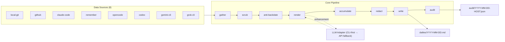
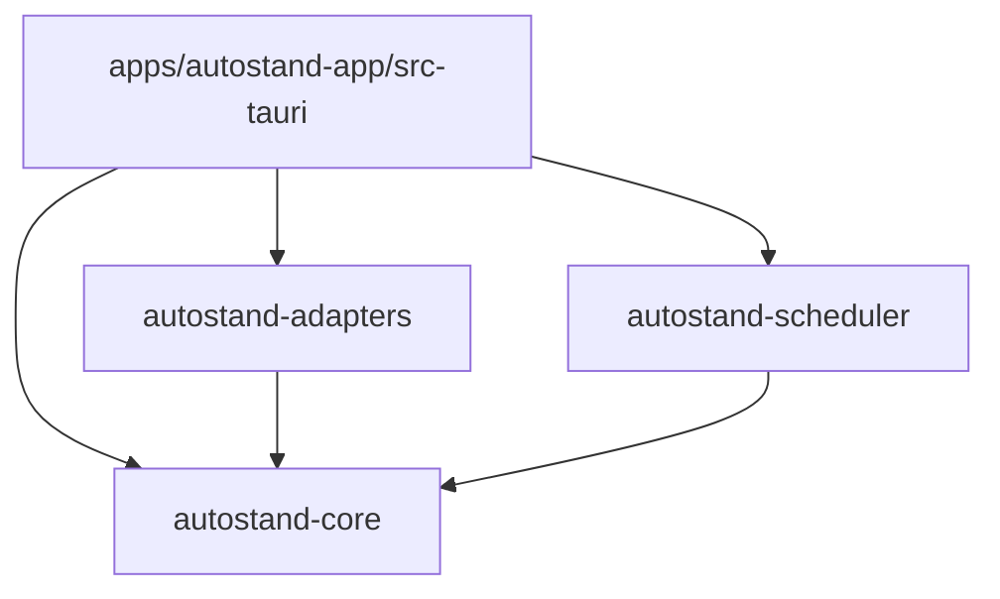

# 01 — System overview

`autostand` automates daily standup generation by gathering work activity from
multiple data sources (local git, GitHub, Claude Code sessions, Remember plugin,
OpenCode, Codex, Gemini CLI, Grok CLI), rendering prose via a pluggable AI provider,
and writing a structured Markdown file to a synced `dailies/` directory.

---

## Design principles

| # | Principle | Rationale |
| --- | --- | --- |
| 1 | **Data-source hierarchy: GIT > GITHUB > CLAUDE-FILES > NOTES** | Most authoritative source wins; commits are ground truth, notes are narrative. |
| 2 | **Accumulate-never-delete** | Re-inject bullets from previous renders that the new render dropped; never silently lose work. |
| 3 | **Anti-backdating** | GIT owns committed work; notes own non-commit work; scrub claims of committed work from notes; SKEW detector flags tickets whose commits fall outside the window. |
| 4 | **Deterministic fallback always computed** | A pure-Rust deterministic renderer always runs; LLM is an enhancement, never a dependency. |
| 5 | **Atomic writes** | write-then-rename + fsync; never corrupt on crash. |
| 6 | **Host slug stability** | Persist once; never derive from DHCP hostname. |
| 7 | **Secrets redaction pre-LLM and pre-write** | Inputs scrubbed before sending to provider; body scrubbed before disk. |
| 8 | **Per-render audit sidecar** | Provenance JSON for every render enables debugging and phantom detection. |
| 9 | **Two-machine sync safety** | Union merge driver for `YYYY-MM-DD.md`; per-host AUTO blocks; single global MANUAL region. |
| 10 | **Resilient self-heal** | Recompile today + previous business day; missed runs fill from durable disk data. |

---

## High-level architecture

---

## Rust workspace crates

| Crate | Responsibility |
| --- | --- |
| `autostand-core` | Domain model, file format, business rules, anti-backdating, accumulate, scrub, redaction, deterministic renderer. Pure Rust, no I/O beyond file read/write. |
| `autostand-adapters` | `LlmAdapter` trait + 5 provider impls (Claude, Ollama, OpenAI/Codex, Gemini, Grok); `DataSource` trait + 8 source impls. Depends on `autostand-core` for the fact/note types it produces. |
| `autostand-scheduler` | Cron expressions, triggers (session-end, manual, launchd/systemd/Task Scheduler), mkdir-based lock with PID + stale timeout, self-heal recompile loop. |
| `apps/autostand-app/src-tauri` | Tauri v2 app bindings. Wires all three crates behind Tauri IPC commands for the React frontend. |

### Workspace dependency graph

`autostand-core` has no internal deps. `autostand-adapters` and `autostand-scheduler`
both depend on `autostand-core`. The Tauri app depends on all three.

---

## Frontend

React + Vite + Tailwind v4 + shadcn/ui inside the Tauri v2 webview. Provides:

- **Settings UI** — provider selection, API key entry (stored in OS keychain), data
  source toggles, scheduler config, host slug display.
- **Provider config** — per-provider CLI path, model, temperature, fallback toggle.
- **Data source toggles** — enable/disable each of the 8 sources per machine.
- **Standup preview** — live preview of `dailies/YYYY-MM-DD.md` with diff against disk.
- **Audit viewer** — render the audit sidecar JSON: provenance, SKEW flags, phantom
  bullets, scrubbed counts, LLM vs deterministic diff.

---

## Cross-platform

Windows, macOS, and Linux via Tauri v2. Platform-specific concerns:

### Host slug derivation

| Platform | Source | Notes |
| --- | --- | --- |
| macOS | `scutil --get LocalHostName` | Falls back to `hostname -s` if `scutil` unavailable. |
| Linux | `/etc/hostname` (minus domain) or `hostnamectl --static` | Domain suffix stripped. |
| Windows | `GetComputerNameW` | Via `windows` crate or `GetComputerNameW` FFI. |

The slug is **validated** (reject numeric-only, reject IP addresses, reject `localhost`)
and **persisted** to `state/host-id` on first run. It is never re-derived.

### Scheduler

| Platform | Mechanism |
| --- | --- |
| macOS | `launchd` plist in `~/Library/LaunchAgents/`. |
| Linux | `systemd --user` unit (`~/.config/systemd/user/`). |
| Windows | Task Scheduler via `schtasks.exe` or COM. |

### CLI path discovery

`git` and `gh` (and provider CLIs) are discovered via `PATH` lookup with a fallback
to well-known install locations. User-configurable paths win. Discovery result is
cached per session.

| Tool | Default probe order |
| --- | --- |
| `git` | `PATH` → `/usr/bin/git` → `/opt/homebrew/bin/git` → `C:\Program Files\Git\bin\git.exe` |
| `gh` | `PATH` → `/opt/homebrew/bin/gh` → `C:\Program Files\GitHub CLI\gh.exe` |
| `claude` | `PATH` → `~/.claude/bin/claude` |
| `codex` | `PATH` → `~/.local/bin/codex` |
| `gemini` | `PATH` → `~/.local/bin/gemini` |
| `ollama` | `PATH` → `/usr/local/bin/ollama` |
| `grok` | `PATH` → `~/.local/bin/grok` |