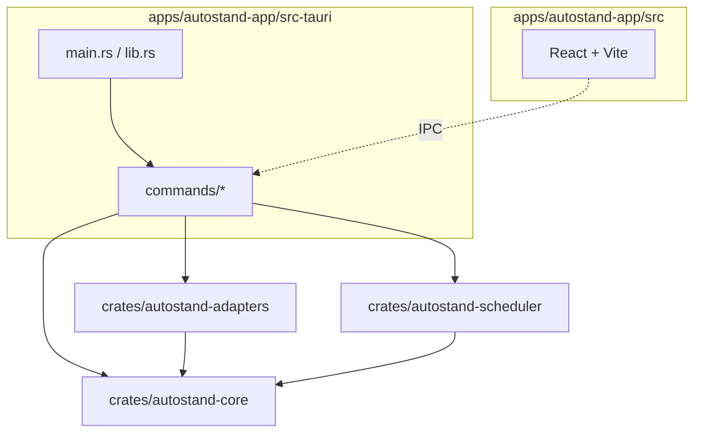

# 02 — Monorepo structure

The repo is a Cargo workspace (Rust) plus a pnpm workspace (frontend + design system +
Storybook). The Tauri v2 app lives under `apps/autostand-app/` and bridges both worlds.

---

## Directory tree

```
autostand/
├── Cargo.toml                    # workspace manifest
├── Cargo.lock
├── package.json                  # root workspace (frontend + design-system + storybook)
├── pnpm-workspace.yaml           # pnpm workspaces
├── .gitignore
├── README.md
├── CLAUDE.md                     # agent instructions
├── AGENTS.md
├── dailies/                      # OUTPUT: generated standup .md files (gitignored or committed — configurable)
├── apps/
│   └── autostand-app/
│       ├── src-tauri/            # Tauri v2 Rust app (depends on all 3 crates)
│       │   ├── Cargo.toml
│       │   ├── tauri.conf.json
│       │   ├── build.rs
│       │   ├── capabilities/
│       │   ├── icons/
│       │   └── src/
│       │       ├── main.rs
│       │       ├── lib.rs
│       │       └── commands/     # Tauri IPC command handlers
│       └── src/                  # React frontend (Vite)
│           ├── main.tsx
│           ├── App.tsx
│           ├── pages/
│           ├── components/
│           ├── hooks/
│           ├── lib/
│           └── styles/
├── crates/
│   ├── autostand-core/           # domain model + business rules
│   │   ├── Cargo.toml
│   │   └── src/
│   │       ├── lib.rs
│   │       ├── standup.rs        # StandupFile, AutoBlock, ManualRegion structs
│   │       ├── format.rs         # file format parser/writer (AUTO/MANUAL blocks)
│   │       ├── dates.rs          # next_business_day, prev_business_day_before
│   │       ├── host.rs           # host slug derivation + persistence
│   │       ├── pipeline.rs       # gather → scrub → anti-backdate → render → accumulate → redact → write → audit
│   │       ├── scrub.rs          # anti-backdate scrub (CLAIM regex, FORBIDDEN/COVERED)
│   │       ├── meta.rs           # meta-work filter (standup tooling self-references)
│   │       ├── accumulate.rs     # never-delete: re-inject uncovered PREV bullets
│   │       ├── redact.rs         # secrets redaction (regex-based)
│   │       ├── textsim.rs        # fuzzy text similarity (shared by accumulate + audit)
│   │       ├── audit.rs          # provenance sidecar writer + phantom detector
│   │       └── deterministic.rs  # pure-Rust deterministic renderer (fallback)
│   ├── autostand-adapters/       # LLM + data source adapters
│   │   ├── Cargo.toml
│   │   └── src/
│   │       ├── lib.rs
│   │       ├── llm/
│   │       │   ├── mod.rs        # LlmAdapter trait
│   │       │   ├── claude.rs     # Claude CLI + API
│   │       │   ├── ollama.rs     # Ollama CLI + API
│   │       │   ├── openai.rs     # Codex CLI + OpenAI API
│   │       │   ├── gemini.rs     # Gemini CLI + API
│   │       │   └── grok.rs       # Grok CLI + xAI API
│   │       └── sources/
│   │           ├── mod.rs        # DataSource trait
│   │           ├── local_git.rs
│   │           ├── github.rs
│   │           ├── claude_code.rs
│   │           ├── remember.rs
│   │           ├── opencode.rs
│   │           ├── codex.rs
│   │           ├── gemini_cli.rs
│   │           └── grok_cli.rs
│   └── autostand-scheduler/      # scheduling + triggers
│       ├── Cargo.toml
│       └── src/
│           ├── lib.rs
│           ├── cron.rs           # cron expressions
│           ├── triggers.rs       # session-end, manual, launchd/systemd/task-scheduler
│           ├── lock.rs           # mkdir-based or file lock with PID + stale timeout
│           └── selfheal.rs       # recompile today + prev business day
├── design-system/
│   ├── tokens/                   # JSON/CSS/Tailwind token definitions
│   ├── components/               # base shadcn/ui components
│   ├── app-components/           # app-specific composite components
│   └── .storybook/               # Storybook 8 config
├── brand/
│   └── logo/                     # SVG, PNG, icon variants
├── docs/                         # this documentation
└── tests/
    ├── unit/
    ├── integration/
    └── e2e/
```

---

## Top-level directory responsibilities

| Path | Responsibility |
| --- | --- |
| `Cargo.toml` | Root workspace manifest. Declares `members`, shared `[workspace.dependencies]`, `[workspace.package]`. |
| `Cargo.lock` | Locked Cargo dependency versions; committed. |
| `package.json` | Root pnpm workspace scripts (build, lint, test, storybook, tauri dev/build). |
| `pnpm-workspace.yaml` | Declares `apps/autostand-app`, `design-system/`, and Storybook as pnpm packages. |
| `dailies/` | Output directory for generated `YYYY-MM-DD.md` files. May be gitignored (single-machine) or committed (two-machine sync). |
| `apps/autostand-app/` | The single Tauri v2 desktop app. `src-tauri/` is Rust; `src/` is React/Vite. |
| `crates/autostand-core/` | Pure-Rust domain: file format, business rules, deterministic renderer. No network, no subprocess. |
| `crates/autostand-adapters/` | All LLM provider impls and all data source impls. Depends on `autostand-core` types. |
| `crates/autostand-scheduler/` | Cron + triggers + lock + self-heal. Depends on `autostand-core` for compile entry point. |
| `design-system/` | Tokens, base shadcn/ui components, app-specific composite components, Storybook config. |
| `brand/` | Logo SVG/PNG/icon variants used by the app and landing page. |
| `docs/` | This documentation tree. |
| `tests/` | Cross-crate integration tests, e2e fixtures, and golden snapshots. Unit tests live inside each crate (`#[cfg(test)]` modules). |

---

## Dependency graph



Key invariants:

- `autostand-core` depends on **nothing** inside this repo. Only external crates
  (`serde`, `chrono`, `regex`, `sha2`, `thiserror`).
- `autostand-adapters` depends on `autostand-core` for the types it produces
  (`Fact`, `Note`, `Window`, `Provenance`).
- `autostand-scheduler` depends on `autostand-core` to call `compile_file()`.
- The Tauri app is the **only** binary target. The three crates are libraries.

---

## Workspace `Cargo.toml` structure

Root `Cargo.toml`:

```toml
[workspace]
resolver = "2"
members = [
  "crates/autostand-core",
  "crates/autostand-adapters",
  "crates/autostand-scheduler",
  "apps/autostand-app/src-tauri",
]

[workspace.package]
version = "0.1.0"
edition = "2021"
rust-version = "1.78"
license = "MIT"

[workspace.dependencies]
# internal
autostand-core      = { path = "crates/autostand-core" }
autostand-adapters  = { path = "crates/autostand-adapters" }
autostand-scheduler = { path = "crates/autostand-scheduler" }

# shared external
serde       = { version = "1", features = ["derive"] }
serde_json  = "1"
chrono      = { version = "0.4", features = ["serde"] }
regex       = "1"
sha2        = "0.10"
thiserror   = "1"
tracing     = "0.1"
tokio       = { version = "1", features = ["full"] }
anyhow      = "1"
```

Each crate's `Cargo.toml` references shared deps via `dep.workspace = true`:

```toml
# crates/autostand-core/Cargo.toml
[package]
name = "autostand-core"
version.workspace = true
edition.workspace = true

[dependencies]
serde.workspace      = true
serde_json.workspace = true
chrono.workspace     = true
regex.workspace      = true
sha2.workspace       = true
thiserror.workspace   = true
tracing.workspace     = true
```

---

## pnpm workspace

`pnpm-workspace.yaml`:

```yaml
packages:
  - apps/autostand-app
  - design-system
```

Root `package.json` scripts aggregate per-workspace commands:

```json
{
  "scripts": {
    "dev": "pnpm --filter autostand-app tauri dev",
    "build": "pnpm --filter autostand-app tauri build",
    "lint": "pnpm -r lint",
    "test": "pnpm -r test && cargo test",
    "storybook": "pnpm --filter design-system storybook",
    "typecheck": "pnpm -r typecheck && cargo check --workspace"
  }
}
```