# 03 — Data flow & pipeline

This is the central diagram of the project. It describes the full path from a
trigger firing to a committed, pushed standup file.

---

## Pipeline flowchart

```mermaid
flowchart TD
  TRIG["1. Trigger
  launchd / systemd / Task Scheduler / manual / session-end"]

  LOCK["2. Acquire lock (mkdir + PID)
  abort if stale < 10min"]
  PULL["3. git pull --rebase --autostash
  (dailies repo)"]

  TODAY["4. Compute F_TODAY = next_business_day(TODAY)
  F_PREV = previous target"]
  LOOP{"5. For each F in
  [F_TODAY, F_PREV]"}

  WIN["5a. Window:
  range_start = prev_business_day_before(F)
  range_end = min(day_before(F), TODAY)"]

  GIT_F["5b. Gather GIT FACTS
  per-repo git log for window, authors, refs"]
  NOTES["5c. Gather NOTES
  today-*.md / .done.md under GITHUB_DIR maxdepth 3
  + central now.md if range_end == today"]

  ANTI["5d. Anti-regression guard
  if FACTS empty but last run had repos → skip"]

  ENR["5e. Enrichment (cached 2700s)
  CONV (Claude Code), PRREV (GitHub reviews),
  GITHUB (PRs), CLAUDEFILES, OPENCODE, CODEX,
  GEMINI-CLI, GROK-CLI"]

  PROV["5f. Provenance / SKEW
  ticket→commit-day map;
  SKEW = note in-range naming a ticket
  whose commits all outside range"]

  AB["5g. Anti-backdating
  FORBIDDEN = tickets in notes committed on different day
  COVERED = tickets in FACTS or GITHUB
  scrub notes (drop CLAIM regex + FORBIDDEN/COVERED)
  scrub meta-work; redact secrets"]

  DIRTY["5h. Dirty check
  hash(FACTS|NOTES|CONV|PRREV|GITHUB|CLAUDEFILES|OPENCODE|CODEX|GEMINI|GROK)
  vs last hash → skip if unchanged"]

  READ["5i. Read existing file
  extract MANUAL region + this host's PREV AUTO block"]

  REND["5j. Render
  deterministic always computed
  LLM per config (auto/llm/det)
  LLM CLI-first → API fallback
  validate (shape + FACTS coverage + no-hallucination)"]

  ACC["5k. Accumulate
  re-inject PREV bullets not covered by new render"]

  RED2["5l. Final redaction"]
  AUDIT["5m. Write audit sidecar (JSON)"]
  WRITE["5n. Write file (atomic write-then-rename + fsync)
  persist hash only on clean LLM render"]

  HEAL["6. Self-heal
  if F_PREV not frozen and AUTO empty → compile_file(F_PREV)"]
  COMMIT["7. Commit + push
  no coauthor; skip files with conflict markers
  union merge driver"]

  TRIG --> LOCK --> PULL --> TODAY --> LOOP
  LOOP --> WIN --> GIT_F --> NOTES --> ANTI --> ENR --> PROV --> AB --> DIRTY
  DIRTY --> READ --> REND --> ACC --> RED2 --> AUDIT --> WRITE
  WRITE --> HEAL --> COMMIT
  LOOP -->|next F| WIN
```

---

## Step-by-step narrative

1. **Trigger** — One of: macOS launchd, Linux systemd user unit, Windows Task
   Scheduler, manual invocation from the Tauri UI, or a Claude Code / OpenCode /
   Codex / Gemini / Grok session-end hook. The session-end hook checks
   `AUTOSTAND_RENDER=1` and aborts if set (anti-recursion).

2. **Acquire lock** — `mkdir`-based lock at `state/.lock` with a `pid` file inside.
   If the existing lock is older than 10 minutes it is treated as stale and
   reclaimed. Concurrent runs abort.

3. **Sync** — `git pull --rebase --autostash` on the `dailies/` repo to pick up
   the other machine's commits before generating.

4. **Compute targets** — `F_TODAY = next_business_day(TODAY)`; `F_PREV` is the
   previous target file. Both are recomputed each run.

5. **Per-file loop** — for each `F` in `[F_TODAY, F_PREV]`:

   a. **Window** — `range_start = prev_business_day_before(F)` (the day before the
   last rendered day in F's AUTO history), `range_end = min(day_before(F), TODAY)`.
   If `F == F_TODAY` and `TODAY` hasn't rolled over, `range_end = TODAY`.

   b. **GIT FACTS** — per-repo `git log --since=<range_start> --until=<range_end+1>`
   filtered by configured authors. Produces structured `Fact` records (commit hash,
   author, repo, message, files touched, ticket refs extracted from message).

   c. **NOTES** — read `today-*.md` and `*.done.md` files under `GITHUB_DIR` at
   `maxdepth 3`, plus the central `now.md` if `range_end == today`. Notes are
   narrative and lowest priority.

   d. **Anti-regression guard** — if FACTS is empty but the previous run had
   non-empty FACTS for this host, skip F (avoid rendering "no work" from a
   transient git failure).

   e. **Enrichment** (cached 2700s) — CONV (Claude Code session summaries), PRREV
   (GitHub PR reviews via `gh`), GITHUB (open/merged PRs), CLAUDEFILES (files
   Claude edited), OPENCODE (sessions + files), CODEX (sessions + files),
   GEMINI-CLI (sessions + files), GROK-CLI (sessions + files). Cache only stores
   exit-0 results; failures are not cached.

   f. **Provenance / SKEW** — build a `ticket → {commit_days}` map. A SKEW is a
   note that names a ticket whose commits all fall outside `[range_start,
   range_end]`. SKEW tickets are flagged in the audit sidecar and excluded from
   the rendered AUTO block.

   g. **Anti-backdating** — `FORBIDDEN` = tickets mentioned in notes that were
   committed on a different day than the note's range. `COVERED` = tickets
   already in FACTS or GITHUB. Scrub notes: drop the `CLAIM` regex (explicit "I
   did X" claims about committed work), drop FORBIDDEN and COVERED ticket
   mentions, drop meta-work (standup tooling self-references), redact secrets.

   h. **Dirty check** — hash of `(FACTS, NOTES, CONV, PRREV, GITHUB, CLAUDEFILES,
   OPENCODE, CODEX, GEMINI, GROK)` compared to `last-<F>-<HOST>.hash`. If
   unchanged, skip the render entirely.

   i. **Read existing file** — if `F` exists, parse it; extract the `MANUAL`
   region verbatim and this host's previous AUTO block (for accumulation).

   j. **Render** — the deterministic renderer **always** runs and produces a
   candidate AUTO block. If config mode is `llm` or `auto`, the LLM adapter is
   invoked (CLI-first → API fallback). LLM output is validated for: shape
   (bullet list), FACTS coverage (every FACT ticket referenced or acknowledged),
   and no-hallucination (no ticket not in FACTS/GITHUB/NOTES). On validation
   failure with `auto` mode, fall back to the deterministic render.

   k. **Accumulate** — compare new AUTO bullets to this host's PREV AUTO block.
   Re-inject any PREV bullet not covered (by fuzzy text similarity) by the new
   render. Never silently delete work.

   l. **Final redaction** — run `redact.rs` over the full rendered body before
   any write.

   m. **Audit sidecar** — write `audit/<F>-<HOST>.json` with: window, source
   counts, SKEW tickets, FORBIDDEN/COVERED sets, scrubbed claim count, LLM vs
   deterministic diff, render mode used, validation result, timestamp.

   n. **Write** — `fileops.set-auto`: write to `<F>.tmp` → `fsync` → rename over
   `<F>`. Persist `last-<F>-<HOST>.hash` only on a clean LLM render (or always for
   deterministic). The hash file is the durable dirty-check signal.

6. **Self-heal** — if `F_PREV` is not yet frozen and its AUTO block is empty,
   call `compile_file(F_PREV)` to backfill from durable disk data.

7. **Commit + push** — `git add dailies/ audit/ state/` → `git commit` (no
   coauthor trailer, no leaked identity) → `git push`. Skip files containing
   conflict markers. The `dailies/` repo uses a union merge driver for
   `*.md` so two-machine edits never produce conflict markers.

---

## Data-source priority

| Tier | Source | Authority | Notes |
| --- | --- | --- | --- |
| 1 | GIT | Authoritative | Commits are ground truth for committed work. |
| 2 | GITHUB | Authoritative | PRs and reviews are ground truth for review work. |
| 3 | CLAUDE-FILES | Attribution | Non-commit file edits attributed to Claude sessions. |
| 3 | OPENCODE-FILES | Attribution | Non-commit file edits from OpenCode sessions. |
| 3 | CODEX-FILES | Attribution | Non-commit file edits from Codex sessions. |
| 3 | GEMINI-FILES | Attribution | Non-commit file edits from Gemini CLI sessions. |
| 3 | GROK-FILES | Attribution | Non-commit file edits from Grok CLI sessions. |
| 4 | NOTES | Narrative | Last resort; subject to anti-backdate scrubbing. |

---

## Cache layer

Enrichment sources (CONV, PRREV, GITHUB, CLAUDEFILES, OPENCODE, CODEX, GEMINI,
GROK) are network/IO-heavy and are cached with a **2700-second (45 min) TTL**.

- Only **exit-0** results are cached. Failures are not cached (so transient
  errors self-correct on the next run).
- Cache lives at `state/cache/<source>-<window-hash>.json`.
- Cache invalidation is window-based: a new `range_start`/`range_end` produces a
  new cache key.
- Manual `--no-cache` flag and a Tauri UI "refresh now" button bypass the cache.

---

## State files

| File | Purpose | Lifetime |
| --- | --- | --- |
| `state/host-id` | Persisted host slug. Written once on first run; never overwritten. | Permanent. |
| `state/.lock/` | mkdir-based lock with `pid` child file. | Per-run. |
| `state/last-<F>-<HOST>.hash` | Last successful render hash for dirty-check. | Per file, per host. |
| `state/last-<F>-<HOST>.facts` | Last non-empty FACTS set (anti-regression). | Per file, per host. |
| `state/cache/` | Enrichment source cache (TTL 2700s). | Rolling. |
| `audit/<F>-<HOST>.json` | Per-render provenance sidecar. | Permanent (committed). |
| `logs/run-<timestamp>.log` | Structured run log (tracing). | Rotating. |