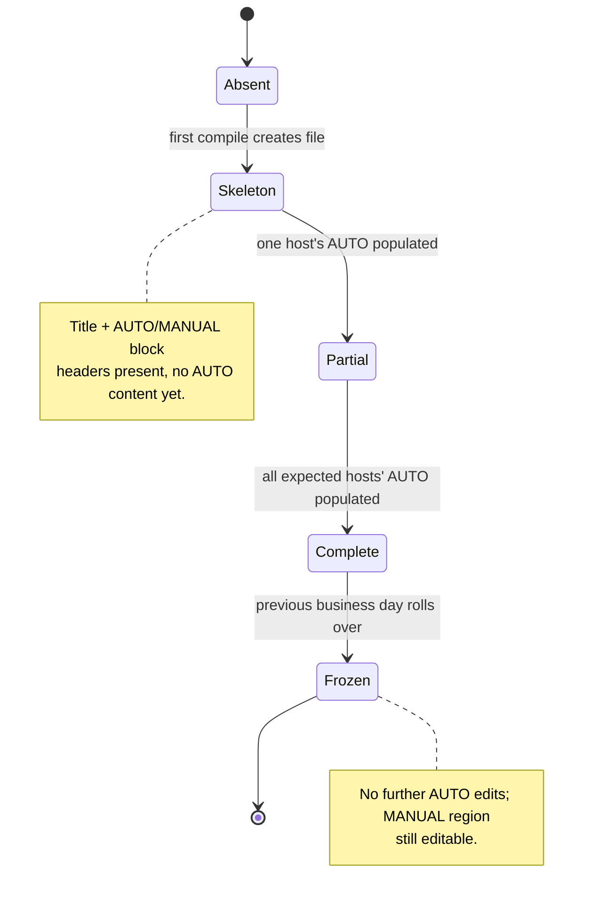
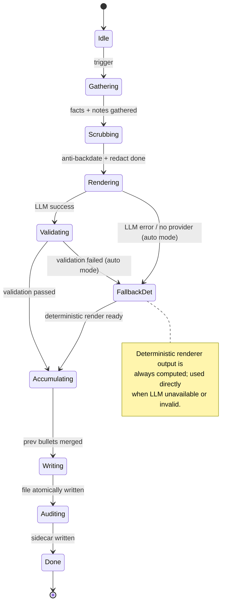
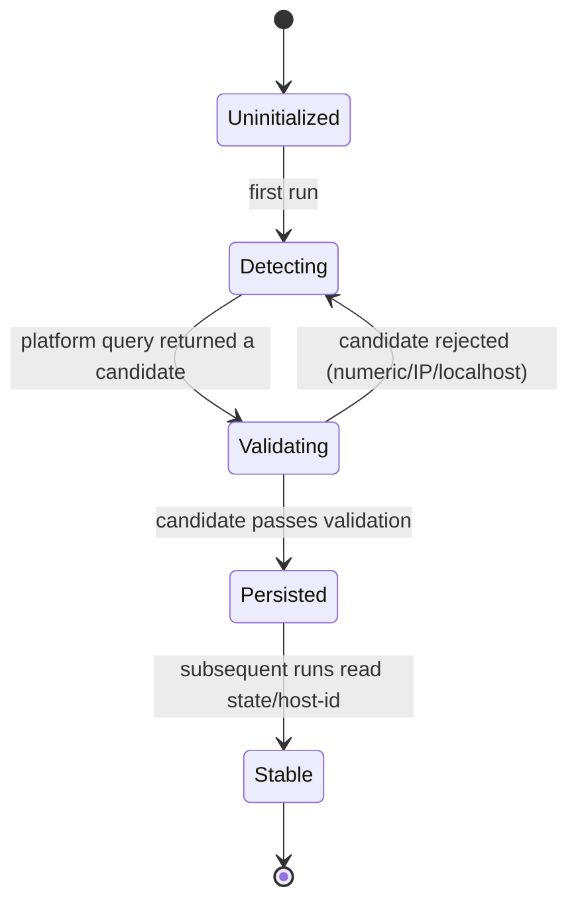
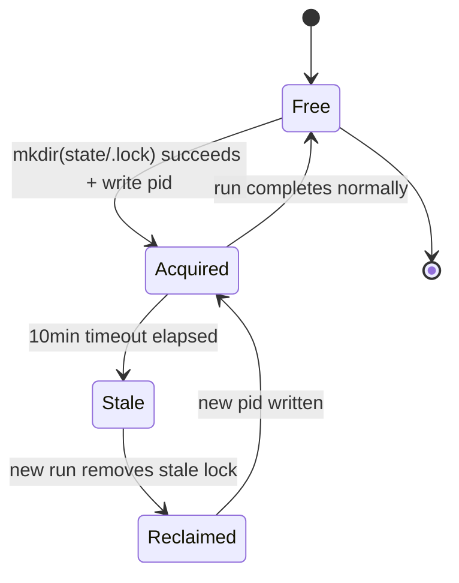
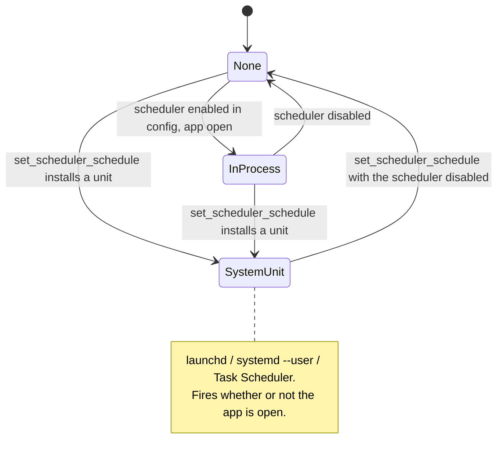
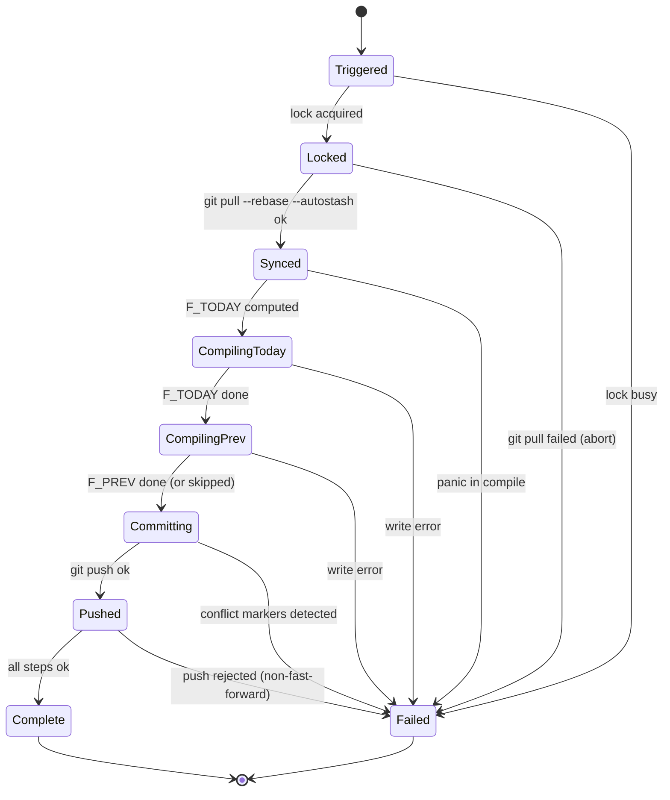

# 04 — State machines

Formal state machines for the long-lived entities in autostand: the standup
file, the render mode, the host slug, the run lock, the scheduler source, and a
single run.

---

## Standup file lifecycle



| State | Entry condition | Exit condition |
| --- | --- | --- |
| `Absent` | File does not exist on disk. | First successful `compile_file(F)`. |
| `Skeleton` | File created with title + `## AUTO` + `## MANUAL` headers. | First host's AUTO block written. |
| `Partial` | At least one expected host's AUTO is populated; others empty. | All expected hosts populated. |
| `Complete` | All hosts in the expected set have non-empty AUTO. | Day rolls over (`next_business_day` advances). |
| `Frozen` | `F < next_business_day(TODAY)` at start of run. | — (terminal). |

"Expected hosts" is the configured set of machine slugs that share the `dailies/`
repo. A single-machine setup has exactly one expected host.

---

## Render mode state machine



| State | Action | Next on success | Next on failure |
| --- | --- | --- | --- |
| `Idle` | Wait for trigger. | `Gathering` | — |
| `Gathering` | Run all 8 `DataSource::gather`. | `Scrubbing` | `Done` (logged) |
| `Scrubbing` | Anti-backdate, meta-scrub, redact. | `Rendering` | `Done` (logged) |
| `Rendering` | Deterministic always; LLM if configured. | `Validating` (LLM) / `Accumulating` (det) | `FallbackDet` |
| `Validating` | Shape + FACTS coverage + no-hallucination. | `Accumulating` | `FallbackDet` (auto) / `Done` (llm mode) |
| `FallbackDet` | Use deterministic render output. | `Accumulating` | — |
| `Accumulating` | Re-inject uncovered PREV bullets. | `Writing` | — |
| `Writing` | Atomic write-then-rename + fsync. | `Auditing` | `Done` (error logged) |
| `Auditing` | Write `audit/<F>-<HOST>.json`. | `Done` | — |
| `Done` | Persist hash if clean render. | — | — |

---

## Host slug states



Validation rules (any failure loops back to `Detecting`):

- Reject if numeric-only (e.g. `123456`).
- Reject if it looks like an IP address (IPv4 or IPv6).
- Reject if equal to `localhost` or `localhost.localdomain`.
- Reject if empty after trim.
- Reject if longer than 63 characters (DNS label limit).

Once persisted to `state/host-id`, the slug is **never** re-derived. DHCP hostname
changes do not affect it.

---

## Lock states



| State | Condition | Transition |
| --- | --- | --- |
| `Free` | `state/.lock` does not exist. | `Acquired` on successful `mkdir`. |
| `Acquired` | `state/.lock` exists; `pid` file mtime < 10min ago. | `Free` on clean run end. |
| `Stale` | `state/.lock` exists; `pid` file mtime > 10min ago. | `Reclaimed` by next run. |
| `Reclaimed` | Stale lock removed; about to acquire. | `Acquired` immediately. |

`mkdir` is atomic on all three platforms; using `mkdir` rather than `open(O_CREAT|`
removes the race between "check then create".

---

## Scheduler source states

Two schedulers can drive a run, and `SchedulerStatus.source` reports whichever
one is actually in charge.



| State | `source` on the wire | What actually fires |
| --- | --- | --- |
| `None` | `"none"` | Nothing. Scheduler disabled, no unit installed. |
| `InProcess` | `"in-process"` | The app's 60 s tokio tick — only while the window is open. |
| `SystemUnit` | `"launchd"` \| `"systemd"` \| `"task-scheduler"` | The OS, running `autostand-app --compile`. |

The mapping is a pure function (`scheduler_runtime::resolve_source`): a unit
detected by `autostand_scheduler::install::detect` always wins, because it is
what will fire at 07:00 tomorrow; with nothing installed the answer is
`in-process` when the schedule is enabled and `none` when it is not.

### Headless entry point

A unit cannot open a window, so it runs the binary's second entry point:

```
autostand-app --compile [--date YYYY-MM-DD]
```

This is the *same* `pipeline_runner` the UI drives — one lock, one step list,
one last-run record. The only difference is that the `AppHandle` is `None`, so
the `pipeline-*` events are dropped and the config is read straight out of the
`tauri-plugin-store` file instead of through the plugin.

| Exit code | Meaning |
| --- | --- |
| `0` | Every target compiled, or was deliberately skipped. |
| `1` | At least one target failed to compile. |
| `2` | The run never started: lock held, unreadable config, or `AUTOSTAND_RENDER=1`. |
| `64` | Bad command line (`EX_USAGE`). |

### Install / uninstall

Installation happens in exactly one place: the IPC command
`set_scheduler_schedule`, which the contract already defines as "persist cron +
reinstall system unit". Never on app start, never from `get_scheduler_status`,
and never from a test — `install::install` refuses when `cfg!(test)` holds, when
`AUTOSTAND_NO_INSTALL` is set, or when the running binary sits in
`target/*/deps/`. Touching the user's login items is not something a status read
is allowed to do.

A failed install is **not** an IPC error: the cron is persisted either way and
the in-process runtime still honours it, so a grumpy `launchctl` must not stop
the user saving a schedule. The failure is logged at `warn`.

| Platform | Unit | Written to | Armed with |
| --- | --- | --- | --- |
| macOS | LaunchAgent plist | `~/Library/LaunchAgents/com.miguel50flowers.autostand.plist` | `launchctl bootout` then `launchctl bootstrap gui/<uid>` |
| Linux | `systemd --user` service + timer | `~/.config/systemd/user/autostand.{service,timer}` | `systemctl --user daemon-reload` then `enable --now` |
| Windows | Task Scheduler task | the Task Scheduler store | `schtasks /Create /F /TN autostand` |

macOS uses `bootstrap`/`bootout` rather than the deprecated `load`/`unload`,
which silently no-op in some session types.

### The translatable cron subset

`install::plan` turns a cron expression into the `minute × hour × weekday` grid
all three formats share, by *enumerating* the expression's runs over one week
through `cron::next_run` — nothing re-implements cron parsing. An expression
outside the subset is **rejected with an error rather than approximated**,
because a unit that fires on the wrong days is worse than no unit at all:

| Rejected | Why |
| --- | --- |
| Any day-of-month or month restriction (`0 9 1 * *`) | POSIX cron ORs day-of-month with day-of-week; no unit format carries that faithfully. |
| More than 1500 run times per week (`*/5 * * * *`) | One plist `dict` per run time; the file stops being a schedule and becomes a data dump. |
| Several start minutes, on Windows only (`0,30 9 * * *`) | `schtasks /ST` takes a single `HH:MM`. |
| Unevenly spaced hours, on Windows only (`0 8,9,17 * * *`) | `/RI` is one constant repetition interval. |

The shipped default `0 7-19 * * 1-5` translates to
`StartCalendarInterval` with 65 entries, `OnCalendar=Mon..Fri *-*-* 07..19:00:00`,
and `/SC WEEKLY /D MON,TUE,WED,THU,FRI /ST 07:00 /RI 60 /DU 12:00`.

### Double-fire safety

An installed unit and an open app both tick. They cannot compile twice: the run
lock (above) serialises them, and both stamp the same durable
`scheduler-last-run.json`, so whichever fires first makes the other's boundary
no longer due.

---

## Per-run states



| State | Action | Failure mode |
| --- | --- | --- |
| `Triggered` | Scheduler unit, in-process tick, UI or hook fires. | Lock busy → `Failed` (logged, not an error). |
| `Locked` | `mkdir` lock + PID. | — |
| `Synced` | `git pull --rebase --autostash`. | Pull conflict → `Failed`, abort run, leave repo for manual fix. |
| `CompilingToday` | `compile_file(F_TODAY)` full pipeline. | Any step error → `Failed`. |
| `CompilingPrev` | `compile_file(F_PREV)` if not frozen. | Any step error → `Failed`. |
| `Committing` | `git add` + `git commit` (no coauthor). | Conflict markers in any staged file → `Failed`, skip commit. |
| `Pushed` | `git push`. | Non-fast-forward → `Failed` (next run re-syncs). |
| `Complete` | Release lock. | — |
| `Failed` | Release lock, write error to `logs/run-*.log`. | — |