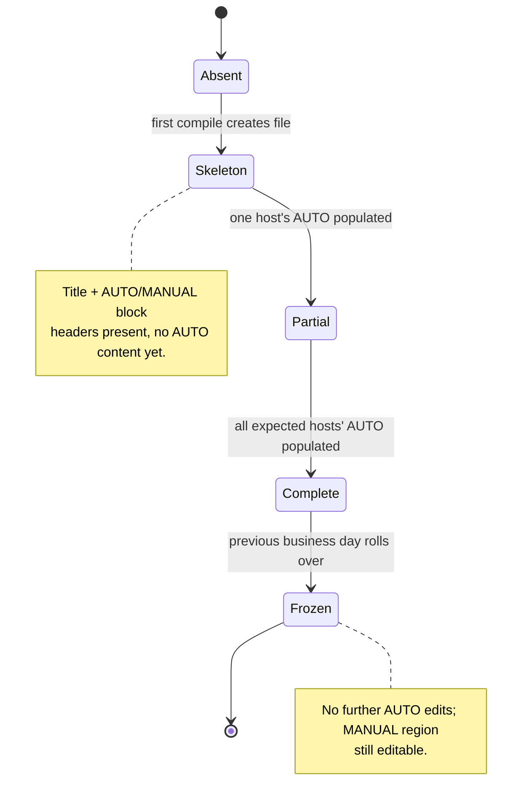
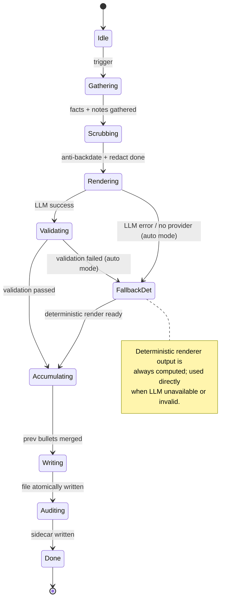
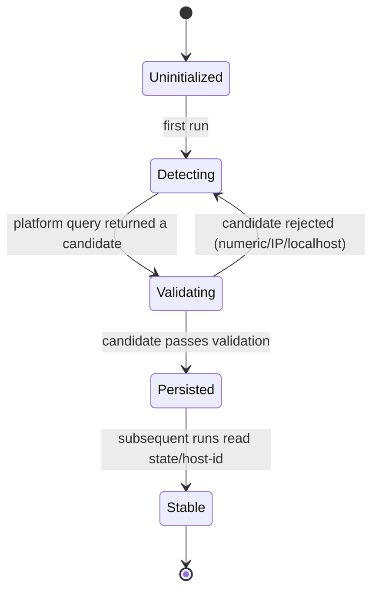
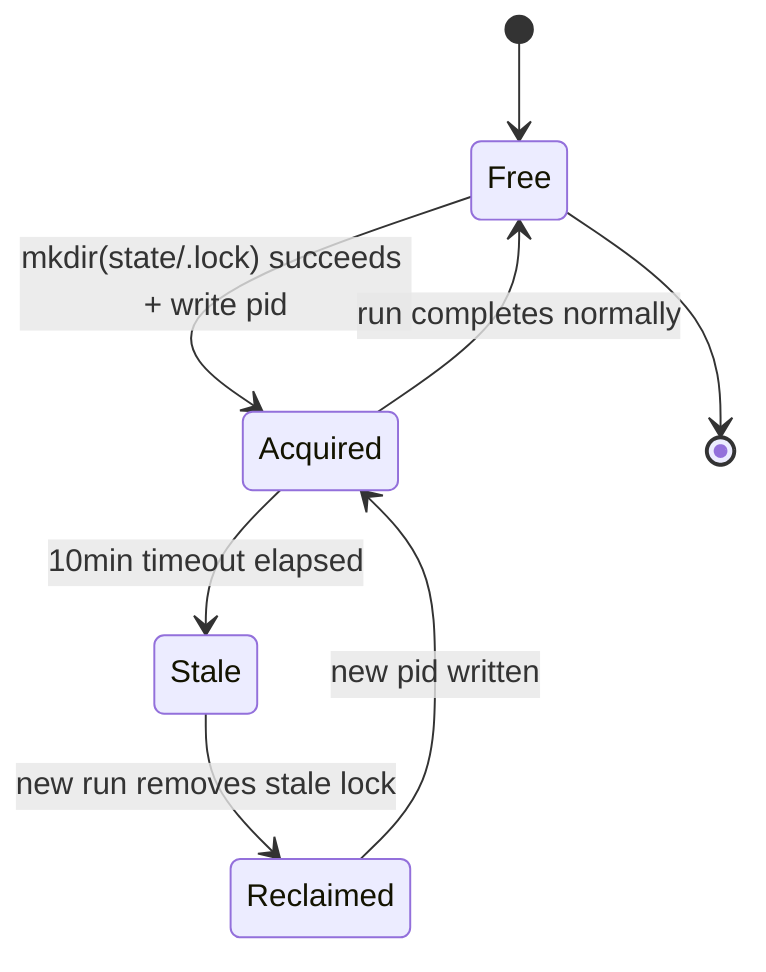
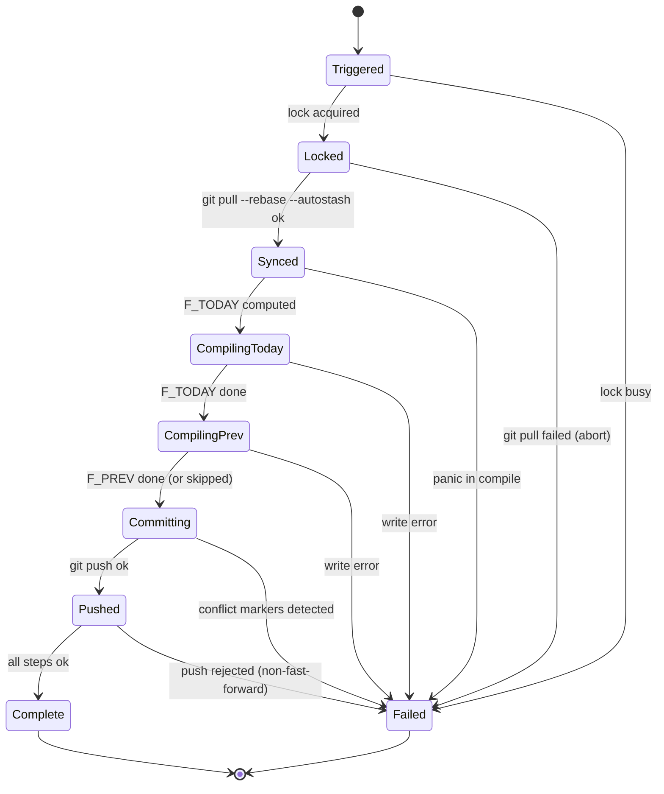

# 04 — State machines

Formal state machines for the four long-lived entities in autostand: the standup
file, the render mode, the host slug, the run lock, and a single run.

---

## Standup file lifecycle

| State | Entry condition | Exit condition |
| --- | --- | --- |
| `Absent` | File does not exist on disk. | First successful `compile_file(F)`. |
| `Skeleton` | File created with title + `## AUTO` + `## MANUAL` headers. | First host's AUTO block written. |
| `Partial` | At least one expected host's AUTO is populated; others empty. | All expected hosts populated. |
| `Complete` | All hosts in the expected set have non-empty AUTO. | Day rolls over (`next_business_day` advances). |
| `Frozen` | `F < next_business_day(TODAY)` at start of run. | — (terminal). |

"Expected hosts" is the configured set of machine slugs that share the `dailies/`
repo. A single-machine setup has exactly one expected host.

---

## Render mode state machine

| State | Action | Next on success | Next on failure |
| --- | --- | --- | --- |
| `Idle` | Wait for trigger. | `Gathering` | — |
| `Gathering` | Run all 8 `DataSource::gather`. | `Scrubbing` | `Done` (logged) |
| `Scrubbing` | Anti-backdate, meta-scrub, redact. | `Rendering` | `Done` (logged) |
| `Rendering` | Deterministic always; LLM if configured. | `Validating` (LLM) / `Accumulating` (det) | `FallbackDet` |
| `Validating` | Shape + FACTS coverage + no-hallucination. | `Accumulating` | `FallbackDet` (auto) / `Done` (llm mode) |
| `FallbackDet` | Use deterministic render output. | `Accumulating` | — |
| `Accumulating` | Re-inject uncovered PREV bullets. | `Writing` | — |
| `Writing` | Atomic write-then-rename + fsync. | `Auditing` | `Done` (error logged) |
| `Auditing` | Write `audit/<F>-<HOST>.json`. | `Done` | — |
| `Done` | Persist hash if clean render. | — | — |

---

## Host slug states

Validation rules (any failure loops back to `Detecting`):

- Reject if numeric-only (e.g. `123456`).
- Reject if it looks like an IP address (IPv4 or IPv6).
- Reject if equal to `localhost` or `localhost.localdomain`.
- Reject if empty after trim.
- Reject if longer than 63 characters (DNS label limit).

Once persisted to `state/host-id`, the slug is **never** re-derived. DHCP hostname
changes do not affect it.

---

## Lock states

| State | Condition | Transition |
| --- | --- | --- |
| `Free` | `state/.lock` does not exist. | `Acquired` on successful `mkdir`. |
| `Acquired` | `state/.lock` exists; `pid` file mtime < 10min ago. | `Free` on clean run end. |
| `Stale` | `state/.lock` exists; `pid` file mtime > 10min ago. | `Reclaimed` by next run. |
| `Reclaimed` | Stale lock removed; about to acquire. | `Acquired` immediately. |

`mkdir` is atomic on all three platforms; using `mkdir` rather than `open(O_CREAT|`
removes the race between "check then create".

---

## Per-run states

| State | Action | Failure mode |
| --- | --- | --- |
| `Triggered` | Scheduler/UI/hook fires. | Lock busy → `Failed` (logged, not an error). |
| `Locked` | `mkdir` lock + PID. | — |
| `Synced` | `git pull --rebase --autostash`. | Pull conflict → `Failed`, abort run, leave repo for manual fix. |
| `CompilingToday` | `compile_file(F_TODAY)` full pipeline. | Any step error → `Failed`. |
| `CompilingPrev` | `compile_file(F_PREV)` if not frozen. | Any step error → `Failed`. |
| `Committing` | `git add` + `git commit` (no coauthor). | Conflict markers in any staged file → `Failed`, skip commit. |
| `Pushed` | `git push`. | Non-fast-forward → `Failed` (next run re-syncs). |
| `Complete` | Release lock. | — |
| `Failed` | Release lock, write error to `logs/run-*.log`. | — |