# Pipeline Spec

This document specifies the `autostand-core::pipeline` module: the ordered steps of a compile, the cache, concurrency, error recovery, and a Mermaid flowchart with function names annotated.

---

## Pipeline steps

Each step is a function in `autostand-core::pipeline`. The entry point is `trigger(source)`. A single compile of one filing date is `compile_file(F, ctx)`. `trigger` may invoke `compile_file` for both `F_TODAY` and `F_PREV`.

### 1. `trigger(source: TriggerSource)`

Entry point. Acquires the single-run lock. Pulls the dailies repo. Computes target dates. Calls `compile_file` for each. Commits and pushes.

```rust
pub async fn trigger(source: TriggerSource, app: &AppHandle) -> Result<()> {
    let _lock = acquire_lock(state_dir(), LOCK_TIMEOUT).await?;
    emit(app, "pipeline-started", StartedPayload { trigger: source.clone(), .. })?;

    git_sync_pull(dailies_dir()).await?;            // git pull --rebase --autostash

    let today = chrono::Local::now().date_naive();
    let (f_today, f_prev) = compute_targets(today);

    let mut results = vec![];
    results.push(compile_file(&f_today, &ctx(app, source.clone())).await?);

    if ctx.scheduler.self_heal {
        results.push(self_heal(&f_prev, host_slug(), app).await?);
    }

    commit_push(&touched_files(), dailies_dir()).await?;

    for r in &results { emit(app, "pipeline-done", r)?; }
    Ok(())
}
```

- **Lock**: `mkdir + PID + 10min stale` (see [Concurrency](#concurrency)).
- **git sync**: `git pull --rebase --autostash` on the dailies repo. Failures log a warning but do not abort (the local copy is still usable).
- **Targets**: `(F_TODAY, F_PREV)` where `F_PREV` is the file the previous run day wrote.

### 2. `compute_targets(today: Date, mode: ArchiveMode)` → `(F_TODAY, F_PREV)`

```rust
pub fn compute_targets(today: NaiveDate, mode: ArchiveMode) -> (NaiveDate, NaiveDate) {
    let f_today = mode.filing_date(today);
    let f_prev  = mode.filing_date(prev_business_day_before(today));
    (f_today, f_prev)
}
```

Both dates go through `ArchiveMode::filing_date`, so the pair follows whichever
filing policy `AppConfig.dates.archive_mode` selects.

`F_PREV` is derived from **today**, not from `F_TODAY`. Walking back from the
*file* lands on Friday during a weekend run and re-opens a day the Friday run
already closed; walking back from *today* and then filing that day names the
file the previous run actually wrote.

The two can be equal, and that is meaningful: in `next_business_day` mode
Friday, Saturday and Sunday all file into the same Monday, so a weekend run is
still *filling* `F_TODAY` and there is no rolled-over day behind it. Step 4 is
skipped outright in that case (`compile.sh:544`).

### 3. `compile_file(F, ctx)` — the core compile for one file

This is the heart of the pipeline. Each sub-step is its own function so it can be unit-tested in isolation and so `preview_gather` can stop after step (e).

| Sub-step | Function | Output |
| --- | --- | --- |
| a | `compute_window(F, mode, today)` | `(range_start, range_end, dates[])` |
| b | `gather_git_facts(window, config)` | per-repo git log, file scope, areas |
| c | `gather_notes(window, dates, github_dir)` | today-*.md/.done.md + now.md |
| d | `anti_regression_guard(F, host)` | `Skip` if FACTS empty but last run had repos |
| e | `gather_enrichment(window, config)` | cached: CONV, PRREV, GITHUB, CLAUDEFILES, OPENCODE, CODEX, GEMINI, GROK |
| f | `compute_provenance(facts, notes, all_git_tickets)` | `(FORBIDDEN, COVERED, SKEW)` |
| g | `scrub_notes(notes, forbidden, covered, meta)` | `clean_notes` |
| h | `scrub_enrichment(conv, ...)` | `clean_conv` |
| i | `redact(facts, clean_notes, clean_conv, github)` | redacted inputs |
| j | `dirty_check(F, host, hash(inputs))` | `Skip` \| `Continue` |
| k | `read_existing(F, host)` | `(manual_region, prev_auto)` |
| l | `render_det(facts, github, notes, conv, prrev)` | `det_body` (always produced) |
| m | `render_llm_outcome_validated_logged(inputs, config, ...)` | body + secret-free provider attempts; invalid output continues the chain |
| n | render decision | winning LLM body, deterministic fallback, or strict `Llm` error |
| o | `accumulate(new_body, prev_auto)` | `final_body` (re-inject uncovered PREV bullets) |
| p | `redact(final_body)` | `clean_body` |
| q | `write_audit(F, host, inputs, render_info)` | sidecar JSON |
| r | `write_file(F, host, title, subtitle, clean_body)` | atomic write |
| s | `persist_hash(F, host, hash)` | only if clean LLM render |

#### (a) `compute_window(F, mode, today)`

```rust
pub fn compute_window(f: NaiveDate, mode: ArchiveMode, today: NaiveDate) -> Window {
    let (range_start, last_claimable) = match mode {
        ArchiveMode::NextBusinessDay => (prev_business_day_before(f), f - 1.days()),
        ArchiveMode::SameDay => (prev_business_day_before(f) + 1.days(), f),
    };
    let range_end = last_claimable.min(today);   // never claim a day that has not happened
    Window { range_start, range_end, dates: natural_days_between(range_start, range_end) }
}
```

**The contract, in both modes:** `range_start` is the day *after* the last day
the previous standup file covered. That is what makes the sequence of standups a
partition of the calendar — no natural day is claimed twice, and none is
dropped. Weekend work always lands in some file; the mode only decides which.

- `next_business_day` (default, App Script): `F = Monday` covers Fri–Sun, so the
  whole weekend accumulates into Monday's standup. Every other weekday covers
  exactly the previous day.
- `same_day`: `F = Monday` covers Sat–Mon; every other weekday covers itself.

`range_end` is clamped to `today` (`compile.sh:179`). When the clamp inverts the
range, `Window::is_empty()` is true and there is nothing to compile —
`compile.sh:181` returns early on the same condition.

`dates` walks **natural** days, not business days (`compile.sh:192-193`).
`range_end` is therefore routinely a Saturday or a Sunday, and `git log
--since/--until` plus the note scan both read the weekend. Filtering weekends
out of `dates` silently dropped every weekend note.

Holidays are not modelled (autostand does not ship a holiday calendar).

**What the run logs here.** Step (a) is the only place that knows both the file
being written and the policy that chose it, so it emits one `pipeline-log` line
carrying both:

```
filing 2026-08-14.md — window 2026-08-13 → 2026-08-13     [archive_mode=next_business_day]
```

That line (and the `archive_mode` field of the sidecar, step (q)) is what makes
"which file did that run write, and why that range" answerable afterwards. An
empty window logs the skip at `warn` with the same detail.

**What the UI asks for.** The Dashboard never derives the filing date itself; it
calls `get_filing_target` (`docs/tauri/02-ipc-contracts.md`), which is built out
of `ArchiveMode::filing_date` + `compute_window` — the same two functions this
step uses. A UI that computed its own answer could announce a file the pipeline
never touches, which is how a machine ended up with `2026-08-13.md` and no
`2026-08-14.md`.

#### (b) `gather_git_facts`

For each repo under `github_dir` (filtered by `standup_authors`), run `git log <git_refs> --since=<range_start> --until=<range_end + 1day> --author=<author>` and collect commits, tickets (parsed from subject), files, and areas (top-level dirs). Result: `Vec<RepoFacts>`.

#### (c) `gather_notes`

Scan `github_dir` for `today-*.md`, `.done.md`, and `now.md` files dated within the window. Each note file produces a `NoteRef { source, date, clauses }` where clauses are the bullet lines.

#### (d) `anti_regression_guard`

If `facts.is_empty()` but the last audit sidecar for `F`/host shows repos were present, return `Skip` — this prevents the standup from going empty due to a transient git/network failure. Logs a warning; emits `pipeline-error` with `code: "anti_regression"` but `CompileResult.status = "skip"`.

#### (e) `gather_enrichment`

Cached gathering of enrichment sources. Each source is cached by `(source, window_hash)` with a 2700s TTL (see [Cache](#cache)). Sources:

- `CONV` — Claude Code conversation digests (`~/.claude/...`)
- `PRREV` — GitHub PR reviews by `review.reviewer` in `review.pr_org` (via `gh`)
- `GITHUB` — GitHub PRs/issues touched in the window
- `CLAUDEFILES` — files Claude Code wrote
- `OPENCODE` — opencode sessions (`~/.local/share/opencode/...`)
- `CODEX` — Codex sessions
- `GEMINI` — Gemini CLI sessions
- `GROK` — Grok CLI sessions

Only sources enabled in `data_sources` are gathered. Only **Ok** results are cached (errors re-fetch next run).

#### (f) `compute_provenance`

See `docs/specs/anti-backdating.md` for the full algorithm. Outputs:

- `FORBIDDEN` — note tickets whose commits are on a day NOT in the window (cross-day backdating).
- `COVERED` — note tickets already in `range_tickets` or GITHUB (don't duplicate from notes).
- `SKEW` — notes dated in-range naming a ticket whose commits ALL fall outside the window.

#### (g) `scrub_notes`

Drop note clauses that: match the CLAIM regex (assert committed work), name a FORBIDDEN ticket, name a COVERED ticket, or match the META regex. See `docs/specs/anti-backdating.md`.

#### (h) `scrub_enrichment`

Same scrub applied to CONV and PRREV text. Removes META references and any FORBIDDEN ticket mentions that would re-introduce backdated claims.

#### (i) `redact`

Apply redaction to all inputs before sending to the LLM: strip absolute paths to repo-relative, redact any tokens matching `meta_extra`, and redact email addresses. Produces the `inputs` struct that `render_llm` consumes.

#### (j) `dirty_check`

Hash the redacted inputs and compare to the persisted hash for `F`/host (in `state/hashes/<F>-<host>.txt`). If the hash matches and the prior render was a clean LLM render, `Skip` — the file is already up to date. Otherwise `Continue`.

#### (k) `read_existing`

Parse the existing `dailies/<F>.md` (if any) into `(manual_region, prev_auto)` where `prev_auto` is the AUTO block body for this host. Used by `accumulate`.

#### (l) `render_det`

Always produced. A deterministic template render of the facts, github, notes, conv, and prrev. This is the fallback if LLM fails. Never skipped.

#### (m) provider-chain LLM render

Per `render_mode`:

- `Det` → return `None` (no LLM call).
- `Llm` → run the configured provider chain; return an error when no provider produces a valid body.
- `Auto` → run the same chain; use `det_body` only after every enabled provider fails.

An explicit `llm.provider_order` supplies the priority. Legacy configs start with `llm.preferred_provider` and append stored providers. Disabled providers are skipped. `fallback_enabled = false` restricts the chain to its first entry, while `AUTOSTAND_LLM_PROVIDER` always represents an explicit single-provider request.

Within each provider, the access mode controls transport attempts. `CliFirst` tries CLI and then API even when the CLI fails; `ApiFallback` tries API only when CLI detection says the binary is unavailable. A rate-limit error is retried once only when the provider supplies a reset delay no greater than `fallback_policy.max_retry_after_secs` (30 seconds by default).

Each transport attempt records only provider, channel, model, status, stable failure classifier, and latency. Raw stderr/API bodies are never copied into events or audit data. The pipeline converts these attempts into process-local provider health inferences and optional exhausted/failover notifications; a later successful attempt clears that provider's inferred failure.

#### (n) validation and render decision

Validate each successful LLM output against the facts before accepting that provider: every ticket mentioned must appear in `range_tickets`; no FORBIDDEN tickets may be introduced; and the required preset sections must be present. Invalid output is recorded as `validation_failed` and the next provider is tried. When the chain is exhausted, `Auto` uses `det_body` and sets `fellback = true`; strict `Llm` returns an error and does not write a deterministic standup.

#### (o) `accumulate`

Re-inject any PREV bullet not covered by the new render. Uses `textsim::covered` (significant-word overlap threshold). See `docs/specs/anti-backdating.md` — **accumulate never deletes**.

#### (p) `redact`

Final redaction pass on `final_body` (in case the LLM reintroduced absolute paths or emails).

#### (q) `write_audit`

Write the audit sidecar JSON to `state/audit/<F>-<host>.json` with permissions `0600`, atomic write. See `docs/specs/audit.md`.

The sidecar records `archive_mode` alongside `window`. The same `F` has two
legitimate ranges depending on the policy, so without it a range cannot be
checked for correctness after the fact.

#### (r) `write_file`

Atomic write of the final standup file: read existing → insert/replace this host's AUTO block before MANUAL:START → atomic write (temp → fsync → rename) with mode `0600`.

#### (s) `persist_hash`

Only if the LLM render was clean (not a fallback). Write `hash` to `state/hashes/<F>-<host>.txt`. This is what makes the next `dirty_check` skip a re-render.

### 4. `self_heal(F_PREV, host)`

If `F_PREV != F_TODAY` (the day has rolled over) and `F_PREV`'s AUTO block for this host is empty, compile it from durable disk data. Durable = git log + notes files still on disk. Skip if `F_PREV` is **frozen** (AUTO block already populated — see `docs/specs/anti-backdating.md`).

```rust
pub async fn self_heal(f_prev: &NaiveDate, host: &str, app: &AppHandle) -> Result<CompileResult> {
    let existing = parse_file(&dailies_dir().join(format!("{}.md", f_prev)));
    if existing.auto_for(host).map(|b| !b.body.is_empty()).unwrap_or(false) {
        return Ok(CompileResult::skip(f_prev, host, "frozen"));
    }
    compile_file(f_prev, &ctx(app, TriggerSource::SelfHeal)).await
}
```

### 5. `commit_push(touched_files)`

```rust
pub async fn commit_push(files: &[PathBuf], dir: &Path) -> Result<()> {
    if files.is_empty() { return Ok(()); }
    // skip marker files (state/, audit/, hashes/) — these are not committed
    let standup_files: Vec<_> = files.iter()
        .filter(|p| p.extension() == Some(OsStr::new("md")))
        .collect();
    if standup_files.is_empty() { return Ok(()); }

    tokio::task::spawn_blocking(move || {
        let dates = standup_files.iter()
            .filter_map(|p| p.file_stem()?.to_str())
            .collect::<Vec<_>>().join(", ");
        std::process::Command::new("git").arg("add")
            .args(standup_files.iter().map(|p| p.as_os_str()))
            .current_dir(dir).status()?;
        std::process::Command::new("git").arg("commit")
            .arg("-m").arg(format!("standup: {dates}"))
            .current_dir(dir).status()?;
        std::process::Command::new("git").arg("push")
            .current_dir(dir).status()?;
        Ok::<_, anyhow::Error>(())
    }).await??;
    Ok(())
}
```

- Only `.md` files are committed; `state/`, `audit/`, `hashes/` are gitignored or never staged.
- Commit message: `standup: <comma-separated dates>`.
- `git push` failure logs a warning but does not abort — the commit is local and will push on the next successful run.

---

## Cache

`gather_enrichment` uses a TTL cache keyed by `(source, window_hash)`. Only **Ok** results are cached; errors re-fetch next run.

| Property | Value |
| --- | --- |
| Backend | JSON files in `state/cache/<source>/<window_hash>.json` |
| TTL | 2700 seconds (45 min) |
| Key | `(source_id, sha256(window.range_start..range_end))` |
| Invalidation | TTL expiry or `set_config` (any change clears the whole cache) |
| Permissions | `0600` (may contain redacted conversation digests) |

```rust
pub struct Cache {
    dir: PathBuf,
    ttl: Duration,
}

impl Cache {
    pub async fn get<T: DeserializeOwned>(&self, source: &str, window: &Window) -> Option<T> {
        let path = self.path_for(source, window);
        let meta = std::fs::metadata(&path).ok()?;
        if meta.modified().ok()?.elapsed().ok()? > self.ttl { return None; }
        let bytes = std::fs::read(&path).ok()?;
        serde_json::from_slice(&bytes).ok()
    }
    pub fn put<T: Serialize>(&self, source: &str, window: &Window, val: &T) -> Result<()> {
        let path = self.path_for(source, window);
        std::fs::create_dir_all(path.parent().unwrap())?;
        let bytes = serde_json::to_vec(val)?;
        let mut tmp = tempfile::NamedTempFile::new_in(path.parent().unwrap())?;
        tmp.write_all(&bytes)?;
        tmp.as_file().sync_all()?;
        tmp.persist(&path)?;
        set_mode_0600(&path)?;
        Ok(())
    }
}
```

---

## Compile Now regeneration

An interactive regeneration is a two-phase operation. The preview phase runs
the same single-date gather/render/validation pipeline with an empty previous
AUTO body, but points both dailies and audit state at an isolated temporary
directory. It never modifies the live standup, commits, pushes, sends a
completion notification, or runs the self-heal target.

The backend returns only this host's `current_auto` and `candidate_auto`, plus an
opaque 30-minute token and a SHA-256 of the exact live file. Apply accepts
`keep_current`, `use_candidate`, or an edited `merge`. Before an atomic write it
rechecks the token, expiry, host and base hash; a concurrent edit invalidates the
preview. Apply uses `set_auto`, so other hosts and the MANUAL region remain
verbatim. User-edited merged text cannot contain AUTO/MANUAL control markers and
passes the normal secret-redaction boundary before write.

Dashboard defaults to **Review changes first** and opens a three-part resolver:
current AUTO, fresh candidate, and an editable combined result. The nearby
**Replace immediately** preference still uses the isolated preview and safety
checks, but applies the candidate automatically after it validates. Both modes
preserve MANUAL content; scheduler compiles continue using the normal
accumulate-never-delete pipeline rather than an unattended conflict dialog.

The LLM validator rejects prompt/context dumps such as `## CONTEXT` +
`prompts:`, raw unified diffs, or repeated internal prompt-envelope sections.
Such output falls back deterministically instead of being filed as a standup.

## Concurrency

A single-run lock prevents two compiles from racing on the same machine.

- **Acquire**: `mkdir state/lock/` (atomic). Write current PID + timestamp to `state/lock/pid`.
- **Stale**: if the lock dir exists and the PID inside is not running, or the timestamp is older than 10 minutes, steal the lock.
- **Release**: `rmdir state/lock/`.

```rust
const LOCK_TIMEOUT: Duration = Duration::from_secs(600); // 10 min

pub async fn acquire_lock(state: &Path, timeout: Duration) -> Result<LockGuard> {
    let lock = state.join("lock");
    for _ in 0..(timeout.as_secs()) {
        match std::fs::create_dir(&lock) {
            Ok(()) => {
                std::fs::write(lock.join("pid"), std::process::id().to_string())?;
                return Ok(LockGuard { path: lock });
            }
            Err(_) => {
                if let Ok(pid_str) = std::fs::read_to_string(lock.join("pid")) {
                    if let Ok(pid) = pid_str.trim().parse::<i32>() {
                        if !is_running(pid) { steal(&lock)?; continue; }
                    }
                }
                tokio::time::sleep(Duration::from_secs(1)).await;
            }
        }
    }
    Err(anyhow!("lock timeout"))
}
```

**No parallel compiles.** A `trigger` call while another is running returns `Err(AppError::Lock)` immediately; the scheduler does not queue.

---

## Error recovery

Any step failure logs to the run log + emits a `pipeline-error` event. The **deterministic fallback** ensures a standup is always produced if any facts/notes exist:

| Step failure | Behavior |
| --- | --- |
| `gather_git_facts` fails for one repo | skip that repo; continue with others |
| `gather_enrichment` fails for one source | skip that source; record in audit sidecar; continue |
| one provider/transport fails | record a safe attempt and continue according to mode/order |
| a provider body fails validation | record `validation_failed` and try the next provider |
| every provider fails in `Auto` | use `det_body`; `fellback = true`; `render_used = "llm_fallback"` |
| every provider fails in `Llm` | abort the compile with a safe aggregate error |
| `write_file` fails | abort `compile_file`; `CompileResult.status = "error"` |
| `git pull`/`git push` fails | log warning; continue (local copy is authoritative) |
| `acquire_lock` fails | abort `trigger`; emit `pipeline-error` with `code: "lock"` |

The run log lives at `<state>/runs/<F>-<host>-<timestamp>.log` and is rotated weekly.

---

## Mermaid flowchart

```mermaid
flowchart TD
    A["trigger(source)"] --> B["acquire_lock (mkdir+PID)"]
    B --> C["git_sync_pull"]
    C --> D["compute_targets(today) → (F_TODAY, F_PREV)"]
    D --> E["compile_file(F_TODAY, ctx)"]
    D --> F["self_heal(F_PREV, host)"]
    E --> G["commit_push(touched_files)"]
    F --> G
    G --> H["release_lock"]

    subgraph compile_file[F]
        CA["a: compute_window(F)"] --> CB["b: gather_git_facts"]
        CB --> CC["c: gather_notes"]
        CC --> CD{"d: anti_regression_guard<br/>FACTS empty?"}
        CD -- "yes, last run had repos" --> SKIP["Skip"]
        CD -- "no" --> CE["e: gather_enrichment (cached, TTL=2700s)"]
        CE --> CF["f: compute_provenance → FORBIDDEN, COVERED, SKEW"]
        CF --> CG["g: scrub_notes"]
        CG --> CH["h: scrub_enrichment"]
        CH --> CI["i: redact(inputs)"]
        CI --> CJ{"j: dirty_check<br/>hash matches?"}
        CJ -- "yes, clean LLM last run" --> SKIP
        CJ -- "no" --> CK["k: read_existing → (manual_region, prev_auto)"]
        CK --> CL["l: render_det → det_body (always)"]
        CL --> CM{"m: ordered provider chain<br/>transport + validation"}
        CM -- "Det / Auto exhausted" --> CN["n: render decision → det_body"]
        CM -- "valid LLM winner" --> CN
        CM -- "Llm exhausted" --> ERR["pipeline error"]
        CN --> CO["o: accumulate(new, prev_auto) → final_body"]
        CO --> CP["p: redact(final_body)"]
        CP --> CQ["q: write_audit(sidecar JSON, 0600)"]
        CQ --> CR["r: write_file(atomic, 0600)"]
        CR --> CS{"s: persist_hash<br/>clean LLM render?"}
        CS -- "yes" --> CT["write hash"]
        CS -- "no" --> CU["skip persist"]
        CT --> DONE["CompileResult"]
        CU --> DONE
        SKIP --> DONE
    end
```



The flowchart matches the function names in `crates/autostand-core/src/pipeline.rs` 1:1. Every box is a `pub` function; arrows are call order. The two `Skip` exits return `CompileResult { status: "skip", .. }` without writing anything.
